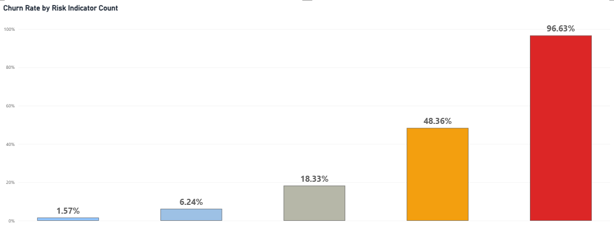
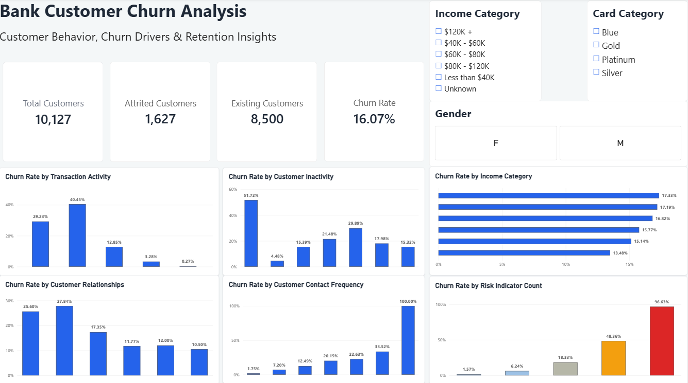

# Bank Customer Churn Analysis

## Project Overview

This project presents an end-to-end analysis of bank customer churn using Python, SQL, and Power BI.

The analysis focuses on understanding customer behaviour, identifying factors associated with churn, and highlighting customer segments that may require greater retention attention.

Python was used for data cleaning, exploratory data analysis, and feature engineering. SQL was used to investigate churn patterns and customer segments, while Power BI was used to develop an interactive dashboard for communicating the key findings.

## Project Objective

The objective of this project is to analyze bank customer data to understand customer churn patterns and identify the key characteristics associated with customers leaving the bank.

The analysis aims to answer business questions related to customer demographics, account activity, product usage, financial behaviour, and churn risk indicators to support customer retention strategies.

## Tools & Technologies

- **Python** – Data cleaning, exploratory data analysis, feature engineering, and visualization
- **SQL** – Customer segmentation and churn analysis using queries
- **Power BI** – Interactive dashboard development and visualization
- **Pandas** – Data manipulation and analysis
- **Matplotlib & Seaborn** – Exploratory data visualization

## Dataset Overview

The dataset contains customer-level banking information used to analyze customer behaviour and churn.

Key variables include:

- Customer demographics such as age and gender
- Credit score and estimated salary
- Account balance
- Customer tenure with the bank
- Number of banking products used
- Credit card ownership
- Active membership status
- Customer complaints
- Satisfaction score
- Churn status

The cleaned dataset used throughout the analysis is available in the `data` folder.

## Data Preparation

The dataset was prepared and cleaned in Python before performing the analysis.

Key data preparation steps included:

- Inspecting the dataset structure, data types, and summary statistics
- Checking for missing values and duplicate records
- Reviewing categorical and numerical variables
- Creating additional features for deeper churn analysis
- Preparing a cleaned dataset for SQL analysis and Power BI visualization

## Exploratory Data Analysis

Exploratory Data Analysis (EDA) was performed in Python to understand customer characteristics, account behaviour, and patterns associated with customer churn.

The analysis focused on:

- Overall customer churn distribution
- Customer demographics and churn behaviour
- Account balance and credit score patterns
- Customer tenure and product usage
- Active and inactive customer behaviour
- Customer complaints and satisfaction
- Identification of churn risk indicators

## Key Findings

- The overall customer churn rate was **16.07%**, with **1,627 attrited customers** out of **10,127 total customers**.
- Transaction activity was strongly associated with churn. Customers completing **31–50 transactions** recorded a churn rate of approximately **40.45%**.
- Customers with fewer banking relationships generally experienced higher churn, including **27.84% churn among customers with two relationships**.
- Higher customer contact frequency was associated with increased churn, with customers recording **five contacts** experiencing a churn rate of **33.52%**.
- Combining four behavioural characteristics into a Risk Indicator Count revealed a strong pattern: churn increased from **1.57% for customers with zero indicators to 96.63% for customers with all four indicators**.
- Customers with **two and three risk indicators accounted for 73.08% of all attrited customers combined**, showing that the group with the highest churn rate is not necessarily responsible for the greatest churn volume.
- The analysis identified **619 existing customers with at least three behavioural risk indicators**, including **6 customers displaying all four indicators**, providing a useful segment for further retention analysis.

## Risk Indicator Analysis

Four behavioural characteristics were combined to create a descriptive Risk Indicator Count:

1. Total transaction count of **50 or fewer**
2. Total relationship count of **2 or fewer**
3. Contact count of **3 or more**
4. Inactive months of **3 or more**

The analysis showed a substantial increase in observed churn as customers accumulated multiple behavioural indicators:

| Risk Indicators | Churn Rate |
|---|---:|
| 0 | 1.57% |
| 1 | 6.24% |
| 2 | 18.33% |
| 3 | 48.36% |
| 4 | 96.63% |

> **Note:** The Risk Indicator Count is a descriptive analytical framework based on historical patterns in this dataset. It should not be interpreted as a predictive machine-learning model or as an individual customer's probability of churn.

## Power BI Dashboard

An interactive Power BI dashboard was developed to summarize the key findings from the customer churn analysis and provide a clear view of customer behaviour and churn patterns.

The dashboard highlights:

- Overall customer churn and retention
- Churn patterns across customer segments
- Transaction and relationship behaviour
- Customer contact and inactivity patterns
- Behavioural risk indicators associated with churn

The Power BI project file is available in the `powerbi` folder.

## SQL Analysis

SQL was used to further investigate customer churn patterns and perform customer segmentation on the cleaned dataset.

The SQL analysis included:

- Overall churn rate analysis
- Churn analysis across customer demographics
- Transaction activity and churn behaviour
- Customer relationship and product usage analysis
- Contact frequency and customer inactivity analysis
- Identification of customers displaying multiple churn risk indicators

The SQL queries used in this project are available in the `sql` folder.

## Project Structure

The repository is organized as follows:

- `data/` – Cleaned dataset used for the analysis
- `python/` – Python notebook containing data cleaning, EDA, feature engineering, and analysis
- `sql/` – SQL queries used for churn analysis and customer segmentation
- `powerbi/` – Power BI project file containing the interactive dashboard
- `images/` – Dashboard screenshots and key visualizations
- `reports/` – Final project analysis report

## Conclusion

This project demonstrates an end-to-end customer churn analysis workflow using Python, SQL, and Power BI.

The analysis identified clear behavioural patterns associated with customer churn, particularly around transaction activity, customer relationships, contact frequency, and inactivity. Combining these characteristics into a descriptive Risk Indicator Count also helped highlight customer groups displaying multiple churn-associated behaviours.

The findings can support further investigation into customer retention strategies and demonstrate how data analytics can be used to transform customer data into actionable business insights.
